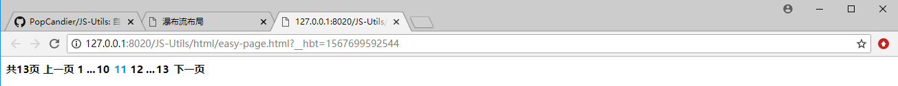

### JavaScript 工具

> 2019/9/5 easy-page.js 可以方便创建分页效果



```html
<script type="text/javascript" src="../js/jquery-3.3.1.min.js" ></script>
<script type="text/javascript" src="../js/easy-page.js" ></script>
<script type="application/javascript">
		$(function(){
			var page=new window.PAGE();
			var page1 = new window.PAGE();
			page.initPage("","#paging-box");
			page1.initPage("","#paging-box1");
		});
</script>
```

> 2019/9/6 masonry.js 瀑布流布局


